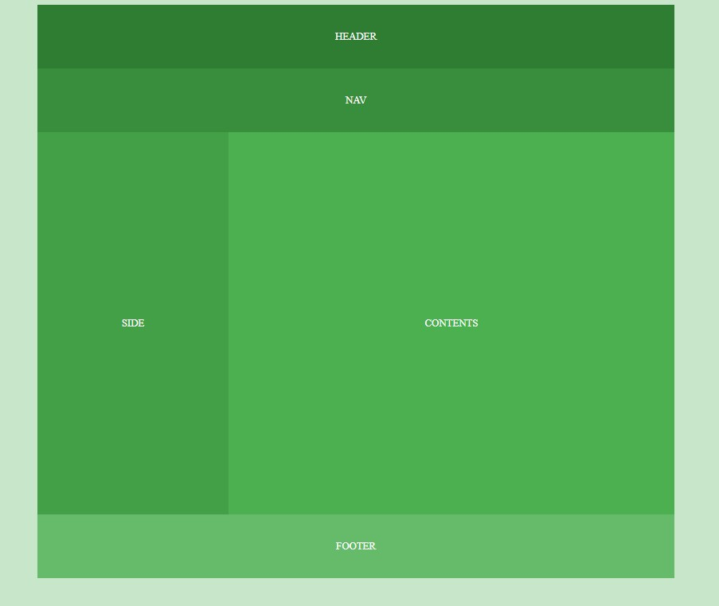
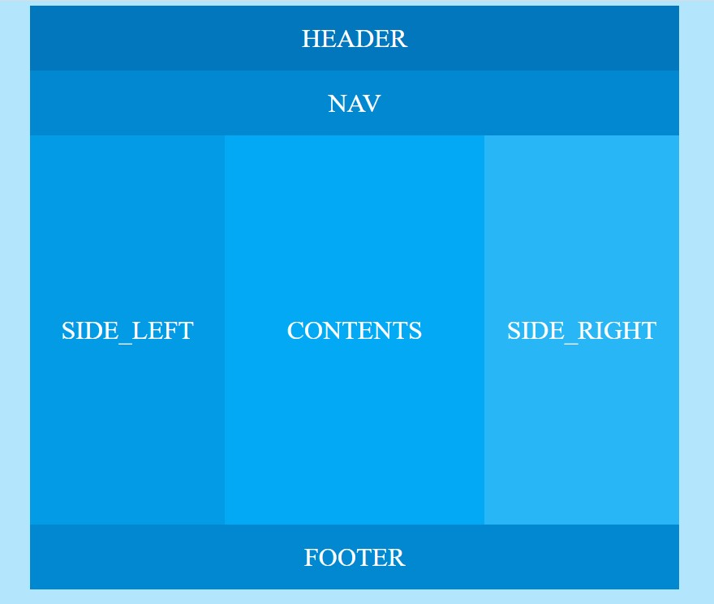
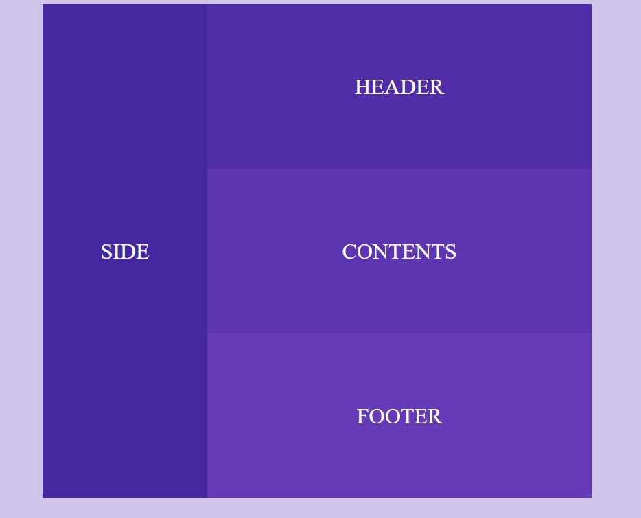
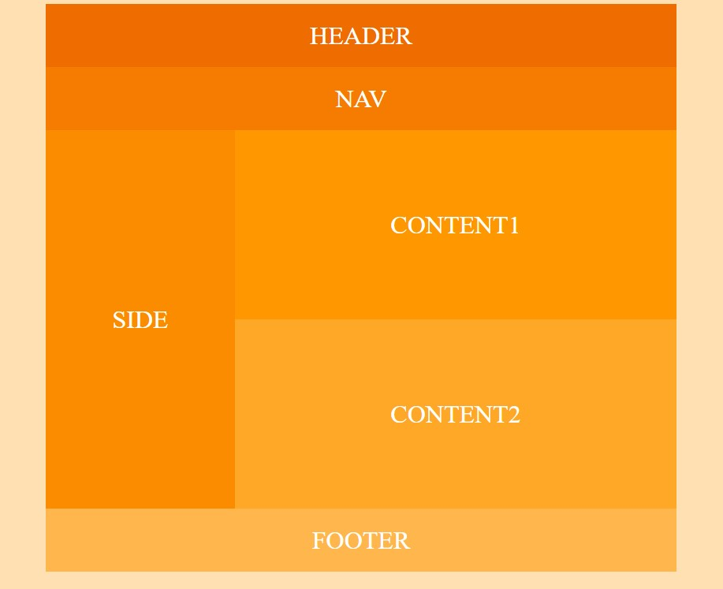
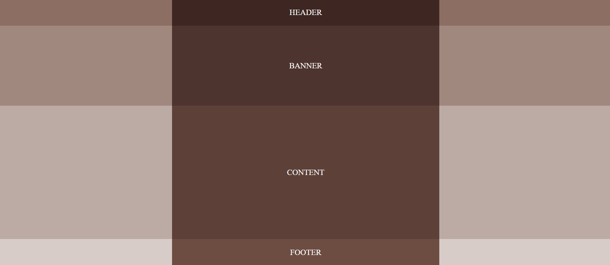
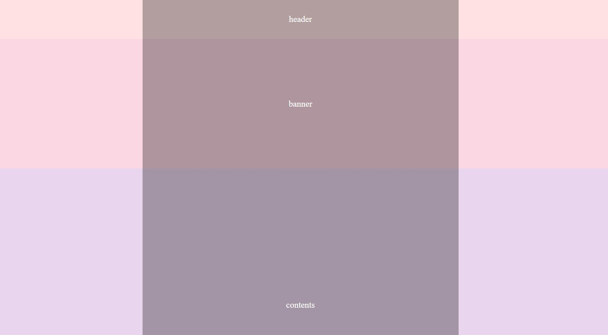
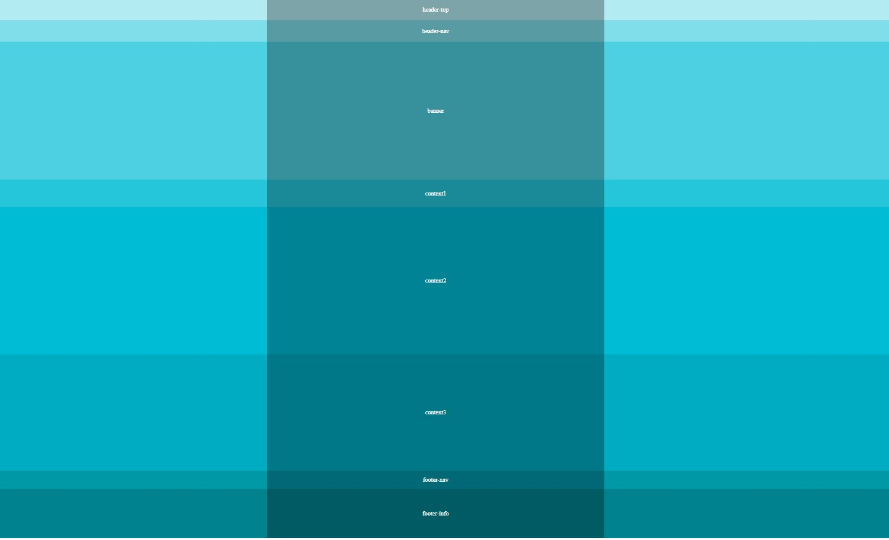

# StandardWebLayout
> This repository is for tutorials of layout of standard of website.
>
> Link : https://youtube.com/playlist?list=PL4UVBBIc6giKixok-bC7XVEx0ZFsngr5Z (in Korean)

<!-- CONTENTS -->
## Contents

### Basic Web Design (Layout 01, 02, 03, 04)

| Layout 01                 | Layout 02                |
|---------------------|-----------------------|
|  |  |

| Layout 03                 | Layout 04                |
|---------------------|-----------------------|
|  |  |

### Responsive Web Design (Layout 05, 06, 07)

| Layout 05                |
|---------------------|
|  |

| Layout 06                 |
|---------------------|
|  |

| Layout 07                |
|---------------------|
|  |

<!-- CONTACT -->
## Contact

Sam Lee - [@LinkedIn](https://www.linkedin.com/in/sam-lee-343862155/) - LeeSam235711@gmail.com

(<a href="#top">back to top</a>)

